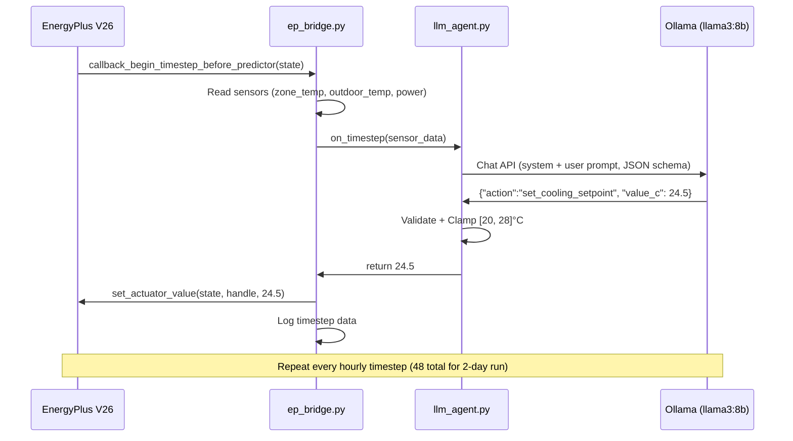

# Eco-Loop Building Agents — Implementation Plan (Updated)

## Problem Summary

Build a closed-loop AI system where EnergyPlus produces live sensor data → a local LLM (Ollama `llama3:8b`) reads it and decides a new HVAC cooling setpoint → the decision is injected back into the running simulation → repeat every timestep. Compare against a static baseline to prove energy savings.

---

## Environment (Confirmed ✅)

| Component | Detail |
|-----------|--------|
| **EnergyPlus** | V26-1-0 at `C:\EnergyPlusV26-1-0\` |
| **Example Files** | `C:\EnergyPlusV26-1-0\ExampleFiles\` |
| **IDF** | `5ZoneAirCooled.idf` (5-zone office, VAV system, chiller) |
| **Weather** | `USA_IL_Chicago-OHare.Intl.AP.725300_TMY3.epw` |
| **Python API** | `pyenergyplus-lbnl` (installed via pip) |
| **LLM** | Ollama with `llama3:8b` (working ✅, RTX 4060 Laptop) |
| **GPU** | RTX 4060 Laptop, 8 GB VRAM |

---

## Key IDF Facts (from inspection)

| Element | Value |
|---------|-------|
| **Target Zone** | `SPACE1-1` (south-facing, highest cooling load) |
| **Cooling Schedule** | `Clg-SetP-Sch` — 23.9°C occupied (6am-8pm weekdays), 29.4°C unoccupied |
| **Control Type** | `ThermostatSetpoint:DualSetpoint` (type 4 on AllOtherDays), references `Clg-SetP-Sch` |
| **Run Period** | Jan 1 – Dec 31 (we'll shorten to Jul 1-2 for fast iteration) |
| **Existing Output Variables** | `Zone Air Temperature`, `Chiller Electricity Rate`, `Cooling Coil Total Cooling Rate`, `Site Outdoor Air Drybulb Temperature` — all hourly ✅ |
| **HVAC System** | VAV with electric chiller + air-cooled condenser + boiler |

---

## Project File Structure

```
d:\Honeywell_Case_Study\
├── README.md
├── requirements.txt
├── config.py                          # Paths, model, bounds, comfort band
│
├── idf_files/
│   ├── 5ZoneAirCooled_baseline.idf    # Original IDF, run period shortened to Jul 1-2
│   └── 5ZoneAirCooled_ai.idf          # + Schedule:Constant actuator for AI control
│
├── weather/
│   └── USA_IL_Chicago.epw             # Symlinked/copied from EP install
│
├── src/
│   ├── __init__.py
│   ├── ep_bridge.py                   # EnergyPlus API wrapper
│   ├── llm_agent.py                   # Ollama LLM agent
│   ├── baseline_runner.py             # Fixed-schedule simulation
│   ├── ai_runner.py                   # AI closed-loop simulation
│   ├── comfort.py                     # Comfort band analysis
│   ├── analysis.py                    # Post-run comparison + export
│   └── idf_patcher.py                 # Auto-patch IDF for AI control
│
├── dashboard/
│   ├── index.html
│   ├── index.css
│   └── app.js
│
├── output/
│   ├── baseline/                      # EP output from baseline run
│   └── ai_controlled/                 # EP output from AI run
│
├── results/
│   ├── comparison_data.json           # For dashboard
│   └── summary_report.md
│
├── docs/
│   └── architecture.md                # System architecture (deliverable)
│
├── main.py                            # Orchestrator
└── run_dashboard.py                   # HTTP server
```

---

## Proposed Changes (10 Phases)

### Phase 1: Project Scaffolding

#### [NEW] [config.py](file:///d:/Honeywell_Case_Study/config.py)
Central configuration:
```python
ENERGYPLUS_DIR = r"C:\EnergyPlusV26-1-0"
IDF_SOURCE = r"C:\EnergyPlusV26-1-0\ExampleFiles\5ZoneAirCooled.idf"
WEATHER_FILE = r"C:\EnergyPlusV26-1-0\WeatherData\USA_IL_Chicago-OHare.Intl.AP.725300_TMY3.epw"
OLLAMA_MODEL = "llama3:8b"
TARGET_ZONE = "SPACE1-1"
COOLING_SETPOINT_MIN = 20.0  # Safety floor
COOLING_SETPOINT_MAX = 28.0  # Safety ceiling
COMFORT_BAND = (21.0, 26.0)  # Acceptable zone temp range
BASELINE_SETPOINT = 23.9     # Fixed schedule value (from IDF)
RUN_PERIOD = (7, 1, 7, 2)    # July 1-2 (summer cooling demand)
```

#### [NEW] [requirements.txt](file:///d:/Honeywell_Case_Study/requirements.txt)
`pyenergyplus-lbnl`, `ollama`, `pandas`, `matplotlib`

---

### Phase 2: IDF Patcher

#### [NEW] [idf_patcher.py](file:///d:/Honeywell_Case_Study/src/idf_patcher.py)

Script that copies and patches the original IDF:

**Baseline IDF patches:**
- Change `RunPeriod` from Jan 1 – Dec 31 → **Jul 1 – Jul 2**
- Add `Output:Variable,*,Facility Total Electric Demand Power,hourly;`
- Add `Output:Variable,*,Zone Thermostat Cooling Setpoint Temperature,hourly;`

**AI IDF patches (additional):**
- Add `Schedule:Constant` named `AI_Cooling_Setpoint_Sch` with type `Temperature`, initial value 23.9
- Modify `Clg-SetP-Sch` reference in `ThermostatSetpoint:SingleCooling` → point to `AI_Cooling_Setpoint_Sch`
- Modify `DualSetPoint` cooling schedule reference → point to `AI_Cooling_Setpoint_Sch`

> [!IMPORTANT]
> **Actuator strategy:** We override the `Schedule:Constant` object `AI_Cooling_Setpoint_Sch` via the EMS actuator `("Schedule:Constant", "Schedule Value", "AI_Cooling_Setpoint_Sch")`. This is the cleanest approach — the Python API actuates the schedule value, which the thermostat reads natively.

---

### Phase 3: EnergyPlus Bridge

#### [NEW] [ep_bridge.py](file:///d:/Honeywell_Case_Study/src/ep_bridge.py)

**Sensors read via `get_variable_handle`:**
| Variable | Key | Purpose |
|----------|-----|---------|
| `Zone Air Temperature` | `SPACE1-1` | Current zone temp |
| `Site Outdoor Air Drybulb Temperature` | `Environment` | Outdoor temp |
| `Chiller Electricity Rate` | `*` | Chiller power (W) |
| `Cooling Coil Total Cooling Rate` | `*` | Cooling load (W) |
| `Facility Total Electric Demand Power` | `*` | Total building power (W) |
| `Zone Thermostat Cooling Setpoint Temperature` | `SPACE1-1` | Current setpoint |

**Actuator (AI mode only):**
| Component Type | Control Type | Component Name |
|----------------|-------------|----------------|
| `Schedule:Constant` | `Schedule Value` | `AI_Cooling_Setpoint_Sch` |

**Callback:** `callback_begin_timestep_before_predictor` — runs before EP calculates loads, perfect for injecting new setpoints.

**Design pattern:**
```python
class EnergyPlusBridge:
    def __init__(self, idf_path, epw_path, output_dir, on_timestep_callback=None):
        """on_timestep_callback(sensor_data: dict) -> Optional[float]
        If returns a float, it's written as the new cooling setpoint.
        If None or not provided, no actuator override (baseline mode)."""
```

---

### Phase 4: LLM Agent

#### [NEW] [llm_agent.py](file:///d:/Honeywell_Case_Study/src/llm_agent.py)

**Prompt template:**
```
System: You are an HVAC optimization AI for a commercial building. Your goal is to 
minimize cooling energy while keeping zone temperature within 21-26°C comfort band.

RULES:
- If zone temp > 25°C, you may LOWER the setpoint to cool more aggressively
- If zone temp < 22°C, you may RAISE the setpoint to save energy
- During unoccupied hours (before 6am, after 8pm), RAISE setpoint to 28°C to save energy
- During occupied hours, keep setpoint between 22-25°C
- Never set below 20°C or above 28°C
- Small adjustments (0.5-1.0°C) are preferred over large jumps

User: Current readings at hour {hour}:00:
- Zone temperature: {zone_temp:.1f}°C
- Outdoor temperature: {outdoor_temp:.1f}°C
- Current cooling setpoint: {current_setpoint:.1f}°C
- Chiller power: {chiller_power:.0f} W
- Total building power: {total_power:.0f} W

Respond ONLY with JSON: {"action":"set_cooling_setpoint","zone":"SPACE1-1","value_c":<number>}
```

**Ollama call with JSON schema enforcement:**
```python
response = ollama.chat(
    model='llama3:8b',
    messages=[{"role": "system", "content": system_prompt}, {"role": "user", "content": user_msg}],
    format={
        "type": "object",
        "properties": {
            "action": {"type": "string"},
            "zone": {"type": "string"},
            "value_c": {"type": "number"}
        },
        "required": ["action", "zone", "value_c"]
    }
)
```

**Safety pipeline:**
1. Parse JSON (fallback: regex for number extraction)
2. Validate `value_c` is numeric
3. Clamp to `[COOLING_SETPOINT_MIN, COOLING_SETPOINT_MAX]` = [20, 28]°C
4. If LLM fails 3 times, use heuristic: `max(22, min(26, zone_temp - 1))`
5. Log every call: prompt, raw response, parsed value, clamped value, latency

---

### Phase 5: Baseline Runner

#### [NEW] [baseline_runner.py](file:///d:/Honeywell_Case_Study/src/baseline_runner.py)
- Uses `EnergyPlusBridge` with `on_timestep_callback=None` (no override)
- The baseline IDF's `Clg-SetP-Sch` schedule controls everything natively
- Logs sensor data to `output/baseline/timestep_log.json`

---

### Phase 6: AI Runner

#### [NEW] [ai_runner.py](file:///d:/Honeywell_Case_Study/src/ai_runner.py)
- Uses `EnergyPlusBridge` with the LLM agent callback
- At each timestep: sensors → LLM prompt → validate JSON → clamp → write actuator
- Logs to `output/ai_controlled/timestep_log.json` with LLM decisions + latency
- Includes per-step timing for the LLM call

---

### Phase 7: Comfort Analysis

#### [NEW] [comfort.py](file:///d:/Honeywell_Case_Study/src/comfort.py)
- Comfort band check: zone temp ∈ [21, 26]°C
- Count comfort violations (too hot / too cold) per timestep
- Calculate % time in comfort for each run
- Flag any dangerous excursions (>30°C or <18°C)

---

### Phase 8: Analysis & Comparison

#### [NEW] [analysis.py](file:///d:/Honeywell_Case_Study/src/analysis.py)
- Load timestep logs from both runs
- Calculate total kWh: `sum(power_W * timestep_hours) / 1000`
- Calculate % energy savings: `(baseline_kWh - ai_kWh) / baseline_kWh * 100`
- Compare comfort violation counts
- Export `results/comparison_data.json` for dashboard
- Generate `results/summary_report.md`

---

### Phase 9: Dashboard

#### [NEW] [dashboard/index.html](file:///d:/Honeywell_Case_Study/dashboard/index.html)
#### [NEW] [dashboard/index.css](file:///d:/Honeywell_Case_Study/dashboard/index.css)
#### [NEW] [dashboard/app.js](file:///d:/Honeywell_Case_Study/dashboard/app.js)

**Design:** Dark glassmorphism theme, premium feel

**Components:**
1. **Hero card** — animated % energy savings counter, large and prominent
2. **Energy comparison chart** — line chart (time vs kW), baseline (red) vs AI (green)
3. **Temperature chart** — zone temp over time with comfort band [21-26°C] shaded
4. **Setpoint decisions timeline** — LLM choices over time vs baseline fixed schedule
5. **Statistics cards** — Total kWh, Peak Power, Comfort %, LLM Avg Latency
6. Chart.js for rendering, loads `comparison_data.json` via fetch

---

### Phase 10: Orchestrator & Documentation

#### [NEW] [main.py](file:///d:/Honeywell_Case_Study/main.py)
1. Patch IDF files (calls `idf_patcher.py`)
2. Run baseline simulation
3. Run AI-controlled simulation
4. Run analysis + comparison
5. Print summary

#### [NEW] [docs/architecture.md](file:///d:/Honeywell_Case_Study/docs/architecture.md)
- Mermaid architecture diagram
- Tool-calling design (custom JSON schema, MCP-style pattern)
- Prompt engineering strategy + latency management
- Simulation log handling (streaming via callbacks, not file parsing)

#### [NEW] [run_dashboard.py](file:///d:/Honeywell_Case_Study/run_dashboard.py)
- `python -m http.server 8080` wrapper for the dashboard directory

---

## Data Flow



---

## Verification Plan

### Automated Tests
```bash
# Phase 2: Verify IDF patches
python -m src.idf_patcher --verify

# Phase 3: Verify baseline EP run completes
python -m src.baseline_runner

# Phase 4: Verify LLM returns valid JSON
python -m src.llm_agent --test

# Phase 6: Verify AI loop runs end-to-end
python -m src.ai_runner

# Phase 8: Full pipeline
python main.py
```

### Manual Verification
- Check `output/baseline/eplusout.csv` for plausible temperature/energy values
- Check `output/ai_controlled/eplusout.csv` for AI-modified setpoints taking effect
- Open dashboard in browser, verify charts render with real data
- Confirm AI achieves >0% energy savings with ≤5% comfort violation increase
